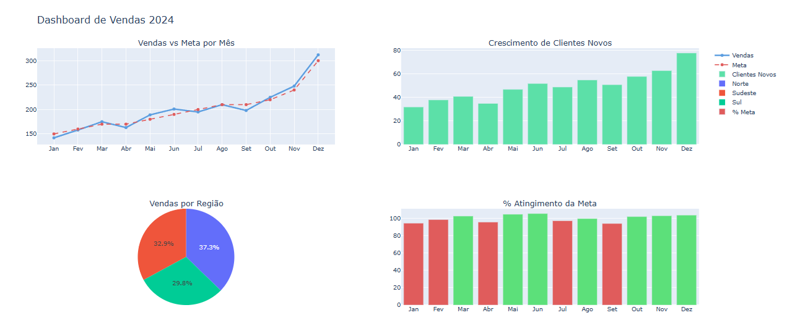

# 📊 Dashboard Interativo de Vendas

Painel de análise de vendas construído com Plotly — todos os gráficos são interativos, sem precisar de servidor ou internet depois de baixar o arquivo.

## Como foi feito

Os dados foram gerados sinteticamente com NumPy simulando um ano completo de vendas com metas, clientes novos e regiões. O dashboard foi montado com Plotly usando subplots — cada gráfico é um trace diferente composto num painel único exportado como HTML interativo.

## Base de dados

Dados sintéticos gerados com NumPy e pandas simulando 12 meses de operação comercial com as seguintes variáveis:

| Coluna | Descrição |
|---|---|
| Mes | Mês do ano (Jan a Dez) |
| Vendas | Volume de vendas realizadas |
| Meta | Meta de vendas definida |
| Clientes_Novos | Novos clientes conquistados no mês |
| Regiao | Região de atuação (Sul, Sudeste, Norte) |

## Tecnologias

- Python 3
- pandas — manipulação e agrupamento dos dados
- NumPy — geração dos dados sintéticos
- Plotly — visualização interativa

## Funcionalidades dos gráficos

**Todos os gráficos**
- Hover — passe o mouse sobre qualquer elemento para ver os valores exatos
- Zoom — clique e arraste para ampliar uma região específica
- Reset — clique duas vezes para voltar à visualização original
- Download — ícone de câmera no canto superior direito salva o gráfico como PNG

**Vendas vs Meta**
- Clique nos itens da legenda para mostrar ou esconder cada linha individualmente

**Barras (Clientes Novos e % da Meta)**
- Hover mostra o valor exato de cada barra
- Barras do % da Meta ficam verdes quando a meta foi atingida e vermelhas quando não foi

**Pizza — Vendas por Região**
- Clique numa região da legenda para removê-la do gráfico
- Hover mostra o valor absoluto e a porcentagem de cada fatia

## Resultado

> A imagem abaixo é apenas ilustrativa. Para acessar o dashboard completo com todas as funcionalidades interativas, clique no botão abaixo.

[▶ Download do dashboard interativo](https://github.com/luccasnn/dashboard-vendas/raw/main/dashboard_vendas.html)

